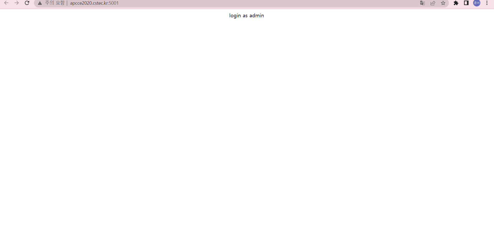
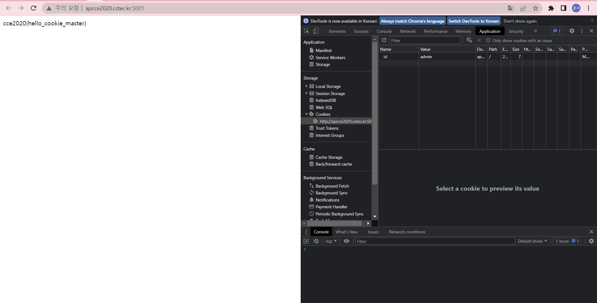

# **COOKIE**

cce 연습문제 Eatcookie문제를 풀이 해보겠다.

먼저 사이트에 들어가면 

login as admin이라고 적혀있다. admin으로 로그인하라고 하는 것 같다.

일단 개발자도구를 열고, Application에 들어갔다.

그리고 웹사이트의 쿠키를 확인했더니 value값이 guest로 되어있었다.

이걸 보자마자 admin으로 바꿔야겠다고 생각했다.

value를 admin으로 바꾸고 f5를 눌렀더니

Flag가 바로 나왔다!

생각을 조금만 하면 바로 풀 수 있는 아주 쉬운 문제였다!!