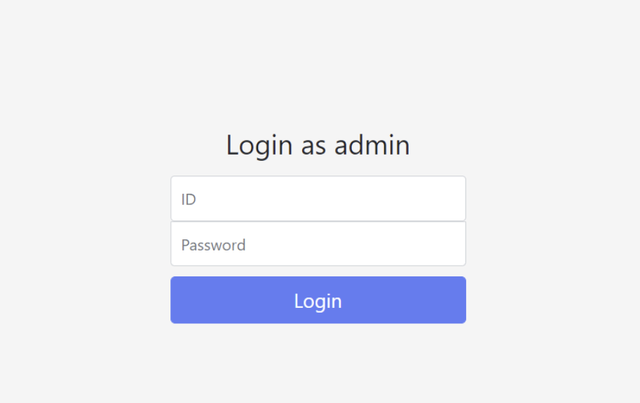
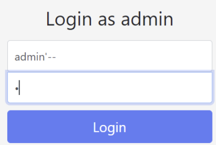
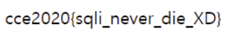

# **Easy SQLi**

cce 연습문제 Easysqli를 풀이 해보겠다.

먼저 주어진 웹사이트에 들어가면



여기서 admin으로 로그인 하라는 메세지와 함께 ID, PASSWD 입력창이 뜬다.

SQL Injection은 클라이언트와 서버사이에 있는 데이터베이스에게 하는 request를 위조하는 것으로

공격자가 요청을 위조하여 원하는 데이터베이스 값을 꺼내는 것이다

위의 문제와 같은 경우는 passwd를 모르는데 admin으로 로그인을 해야되는 상황이므로

request가 ID가 admin일때만 admin으로서 로그인 되게 해야된다.

일단 위의 문제에서 sql의 쿼리가 대충

```sql
select * from user_table where uid=’admin' and upw='*****';
```

이렇게 될 것이다. 위는 user라는 table에서 uid가 admin일때와 upw가 *****(모르는 값)일 때 값이 나오게 되어있다.

이런 상황에서 ID만 admin인 것을 알기 때문에 uid = ‘admin’이라는 구문은 살리고 그 뒤에 upw와 관련된 구문은 주석처리를 해야지 원하는 값을 얻을 수 있다.

sql에서의 주석처리는 ‘--’, ’#’등이 있다.



위는 -- 의 주석처리 방법을 사용한것이다. 저렇게 ID 입력창에 문자열을 끝낼 수 있도록 ‘(작은 따옴표)를 넣어주고 그 뒤를 주석처리 해주는 ‘--’를 넣어주면 된다

그리고 PW입력창에 아무 값이나 입력을 하게되면 



로그인이 되고 다음과 같은 Flag가 나오게 된다.