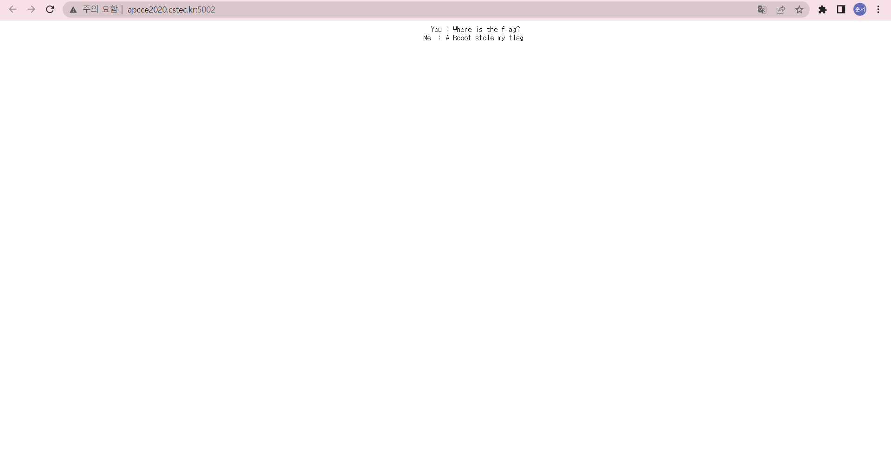
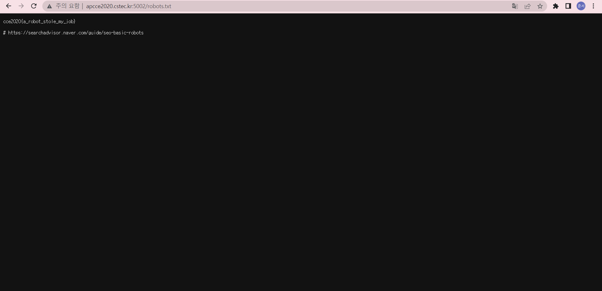

# **Robots**

cce 연습문제 Robots 문제를 풀이를 해보겠다.

먼저 웹사이트에 들어가면

웹사이트에 로봇이 나의 Flag를 훔쳐갔다! 라는 말이 있다.

이걸 보고 robots.txt가 떠올랐다.

robots.txt는 웹사이트에 웹 [크롤러](https://namu.wiki/w/%ED%81%AC%EB%A1%A4%EB%A7%81)같은 로봇들의 접근을 제어하기 위한 규약이다.

이 robots.txt라는 파일을 보려면 최상위 경로에 있어야 하므로 사이트 url을 치고 바로 다음에 /robots.txt를 치면 된다.

그래서 사이트 url 뒤에 /robots.txt를 쳤더니

 

Flag가 바로 나왔다.

robots.txt에 대한 지식이 조금 있거나, 구글링을 조금 해보면 알 수 있는 문제였다.