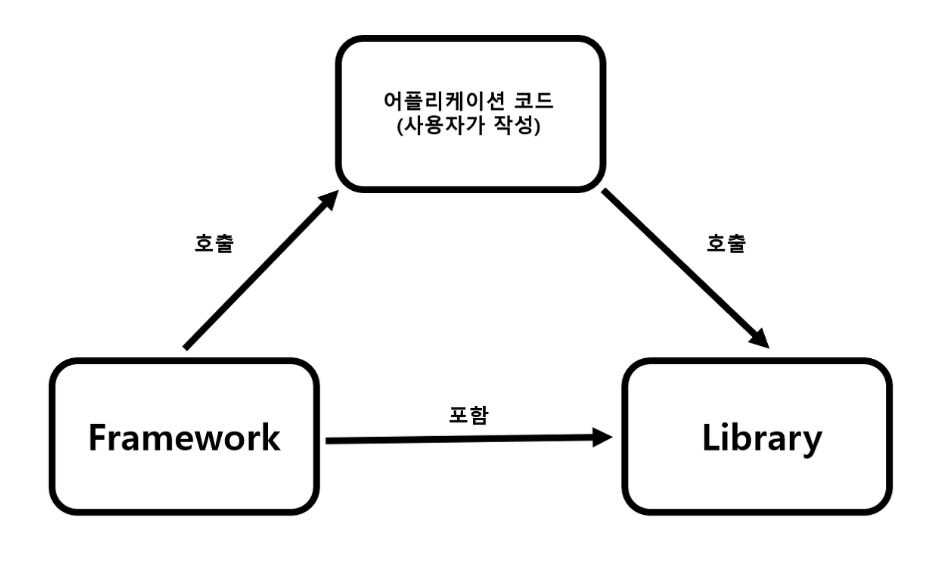

# **프레임워크 vs 라이브러리**

## **정의**📃

### 🚩**프레임워크?**

원하는 기능 구현에 집중하여 개발할 수 있도록 일정한 형태와 필요한 기능을 갖추고 있는 **골격, 뼈대**

**프레임워크**는 애플리케이션 개발을 할 때 필수적인 코드, 알고리즘, 데이터베이스 연동등의 기능들을 위해 어느정도의 **기초적인 구조를 제공**한다

이런 기초적인 구조, 즉 애플리케이션 개발을 위한 뼈대를 기반으로 사용자는 코드를 작성해서 에플리케이션을 개발한다

앱/서버등의 구동, 메모리 관리, 이벤트 루프같은 공통된 부분은 프레임워크가 관리하며, 사용자는 프레임워크가 지정해준 방식대로 클래스 매서드등을 구현한다

### **🔍프레임워크의 예시**

- **JAVA 서버 개발에 사용되는 Spring**
- **Python 서버 개발에 사용되는 Django와 Flask**
- **안드로이드 앱개발에 사용되는 Android**
- **아이폰 앱 개발에 사용되는 Cocoa Touch**
- **웹 개발에 사용되는 Angular, Vue.js**
- **자바 기반으로 JSP를 위한 프레임워크 Structs**
- **루비로 작성된 MVC패턴을 이용하는 Ruby on Rails**

### 📚**라이브러리?**

소프트웨어를 개발할 때 컴퓨터 프로그램이 사용하는 비휘발성 자원의 모임

즉, 특정 기능을 모은 코드, 함수들의 집합이다

또한 코드 작성 시 활용 가능한 도구들을 의미한다

### **🔍라이브러리의 예시**

- Python pip로 설치한 모듈 (tensorflow, pandas, beautifulsoup etc..)
- C++의 표준 템플릿 라이브러리 (STL)
- Node.js에서 npm으로 설치한 모듈
- HTML의 클라이언트 사이드 조작을 단순화하는 JQuery
- 웹에서 사용자 인터페이스 개발에 사용되는 React.js

### 💡**React는 프레임워크??**

대부분의 사람들이 React가 대표적인 프레임워크라고 생각하는 경우가 많은데

사실은 그렇지 않다 

React 공식 홈페이지에도 나와있는 내용으로 React는 프레임워크가 아닌 라이브러리로 분류된다고 한다

→ 따라서 React는 웹 서비스 중에서 사용자의 인터페이스 개발을 위해 사용되는 라이브러리이다 

### **⚔프레임워크 vs 라이브러리**

프레임 워크와 라이브러리에 가장 큰 차이점은 **제어흐름**에 있다

라이브러리를 사용하는 경우 사용자는 애플리케이션 코드의 흐름을 **직접제어**해야한다

반면에 프레임워크는 애플리케이션의 코드가 프레임워크에 의해 사용된다

애플리케이션 코드는 프레임워크가 짜 놓은 틀에서 **수동적으로 동작**하기 때문에 제어의 흐름은 프레임워크가 가지고 있고 사용자가 그 안에 필요한 코드를 작성하게 된다

### **제어의 역전?**

어떠한 일을 하도록 만들어진 프레임워크에 Control 권한을 위임하는 것을 의미한다.

간단히 말해 프로그램의 제어 흐름 구조가 뒤바뀐 것을 뜻한다  

<aside>
💡 라이브러리의 경우 애플리케이션의 흐름을 사용자가 직접 제어해야 하지만 
프레임워크의 경우 코드를 연결할 수 있는 위치를 제공하고 필요에 따라 사용자가 연결한 코드를 호출하는 제어 흐름 권한을 가지고 있다

</aside>

### **✔프레임워크와 라이브러리의 차이점 비유**

### 👀**프레임워크는?**

프레임워크는 모델하우스를 짓는 것에 비유할 수 있다

모델하우스에서는 가구들의 위치, 방의 용도등 수정할 수 있는 범위가 제한적이다

모델하우스라는 틀 안에 맞춰 움직일 수 있는 것이다

프레임워크도 이와 같이 프레임워크가 제공하는 틀에 맞춰서 코드를 작성해야한다

즉, 통제권은 사용자가 아닌 프레임워크가 쥐고 있는 것이다

### 👀**라이브러리는?**

라이브러리는 가구를 사서 조립하는 것에 비유할 수 있다

가구판매점에서 기초적인 재료를 사서 입맛대로 조립하고 배치할 수 있다

라이브러리도 이와 같이 재료의 선택권이나 통제권은 사용자에게 있는 것이다