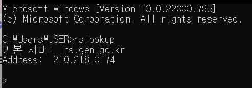

### **Domain Name?**

Domain Name에 대해 알려면 먼저 URL의 구성요소인 Host를 살펴봐야한다.

Host는 IP Address와 Domain Name의 값을 가지게 된다.

IP Address는 네트워크상에서 통신이 이루어질 때 장치를 식별하기 위해 사용되는 주소인데

IP Address는 사람이 외우기 어려우므로, 일반적으로는 도메인의 특성을 담은 이름을 정의하여 IP 대신 사용한다.

Domain Name을 Host 값으로 이용할 때, 브라우저는 **Domain Name Server(DNS)**
에 Domain Name을 질의하고, DNS가 응답한 IP Address를 사용한다.

예를 들어, 웹 브라우저에서 `http://example.com`에 접속할 경우, DNS에 질의해 얻은 `example.com`
의 IP와 통신하는 것이다.

이와 같은 Domain Name의 정보는 cmd에서 **nslookup** 명령어로 확인할 수 있다.

  

