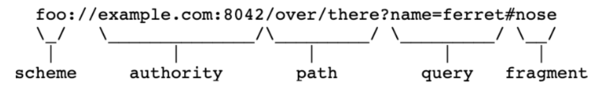

# **URL?**

URL이란 **U**niform **R**esource **L**ocator의 약자로 웹에 있는 리소스의 위치를 표현하는 **문자열**이다.

URL은 Scheme, Authority (Userinfo, Host, Port), Path, Query, Fragment 등으로 구성된다.

| 요소 | 설명 |
| --- | --- |
| Scheme | 웹 서버와 어떤 프로토콜로 통신 할지 나타낸다. |
| Host | Authority의 일부로, 접속할 웹 서버의 주소에 대한 정보를 가지고 있다. |
| Port  | Authority의 일부로, 접속할 웹 서버의 포트에 대한 정보를 가지고 있다. |
| Path | 접근할 웹 서버의 리소스 경로로 '/'로 구분된다. |
| Query | 웹 서버에 전달하는 파라미터이며 URL에서 '?' 뒤에 위치한다. |
| Fragment | 메인 리소스에 존재하는 서브 리소스를 접근할 때 이를 식별하기 위한 정보를 담고 있습니다. '#' 문자 뒤에 위치합니다. |