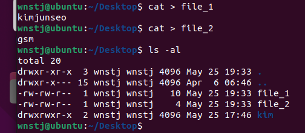
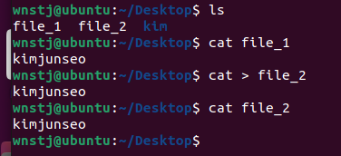

### **What is Redirection?**

표준 입력이나 출력을 꼭 키보드나 화면으로 하는 것이 아닌, 파일로 입력을 받거나 출력 하도록 변경하는 것을 의미함

| Redirection |  |  |
| --- | --- | --- |
| > | 표준출력 | 명령 > 파일 명령의 결과를 파일에 저장 | 
| >> | 표준출력(추가) | 명령 >> 파일 명령의 결과를 파일에 추가 |
| < | 표준입력 | 파일의 데이터를 명령에 입력 |

