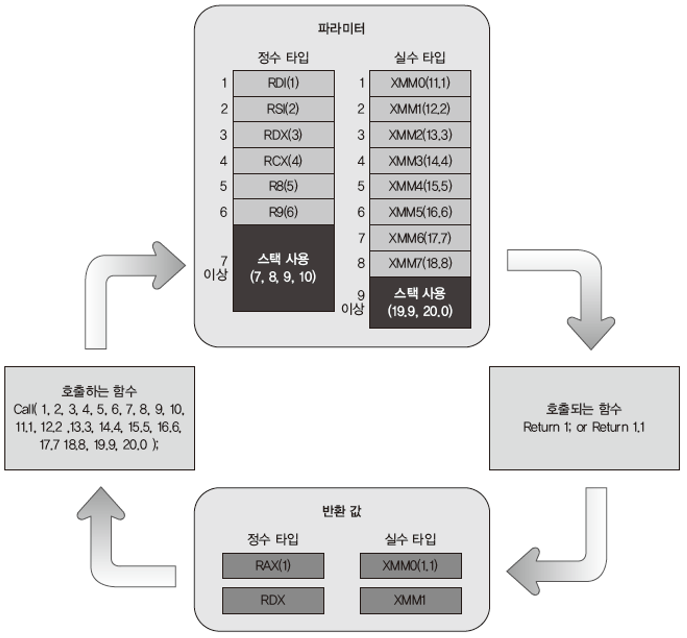

## **함수 호출 규약**

**32 bit Architecture (운영체제) vs 64 bit Architecture**

- CPU 가 처리하는 데이터의 처리 값이 다르다 → 레지스터의 크기가 다르다
    - CPU 는 레지스터를 이용하여 데이터를 처리한다
    - 32 bit Architecture: 2^32   ex) EAX, ECX ...
    - 64 bit Architecture: 2^64   ex) RAX, RCX ...
- Calling Convention
    
    Calling Convention(함수 호출 규약) 은 호출자(caller) 와 피호출자(callee) 간의 함수의 인자를 전달하는 방식에 대한 규약을 정의한 것을 의미한다
    

### **32bit 함수 호출 규약**

### ***cdecl***

- C언어에서 사용되는 방식으로 call(**함수를 호출한 곳)하는 쪽에서 스택을 정리**한다
- 매개변수를 스택에 push하여 함수 호출 시 전달한다
- main 함수에서 add함수를 호출하는 경우 main함수에서 스택을 정리한다. (ex. ADD사용하여 esp 값 증가)

### ***stdcall***

- cdel과 반대로 호출된 함수에서 스택을 정리한다
- c언어는 기본적으로 cedcl이므로 해당 방식으로 컴파일 하려면 함수 앞에 _stdcall 키워드를 붙여야 한다
- 매개변수를 스택에 push하여 함수 호출 시 전달한다
- main 함수에서 스택을 정리하지 않고 ADD함수의 RETURN 명령에 정리할 스택의 크기를 포함시켜 정리한다. RETN 8(RETN + POP8) 명령어를 사용 (코드의 길이가 줄어든다는 장점)

### ***fastcall***

- stdcall 방식과 같되, 함수에 전달하는 파라미터 일부(최대 2개까지)를 스택이 아닌 레지스터를 이용한다
- 이때 이용하는 레지스터는 ECX, EDX이다

### **64bit 함수 호출 규약**

fastcall 방식(함수의 인자가 레지스터로 전달 방식)만 이용한다

다만 변형된 fastcall로 함수 파라미터 4개까지 레지스터에 저장하여 전달한다

각 파라미터 순서에 대한 레지스터가 결정되어 있다

- 리눅스 기준

정수 → RDI, RSI, RDX, RCX, R8, R9 (6개 이상은 스택에 저장한다)

실수 → XMM0~XMM7

- 윈도우 기준

정수 → RCX, RDX, R8, R9

실수 → XMM0~XMM3

레지스터를 사용하여 파라미터 전달

반환값은 일반적으로

정수 → RAX (하위 64bit), RDX (상위 64bit)

실수 → XMM0 (하위 128bit), XMM1(상위 128bit)

레지스터로 넘겨진다

단, 매개변수 레지스터들이 비어있지 않은 경우 오류가 발생할 수 있다